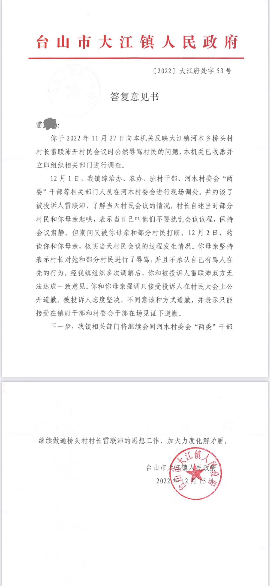
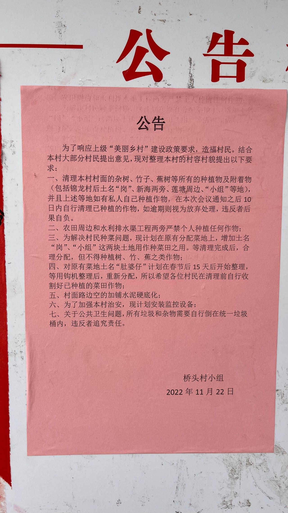

# 关于广东省台山市大江镇河木乡桥头村村长雷联沛违法乱纪的事件说明

LEI 发布于: 2022年12月18日

2022年11月27日，我对台山市大江镇河木乡桥头村村长雷联沛开村民会议时公然辱骂村民一事进行举报。

2022年12月15日，台山市大江镇人民政府发出《答复意见书》，由《答复意见书》已经可以看出，村长雷联沛已承认了公然辱骂行为，公然辱骂已是铁的事实，只是大江镇人民政府在措辞上没有明说。

引用《答复意见书》原文：

> 被投诉人态度坚决，不同意该种方式道歉，并表示只能接受在镇府干部和村委会干部在场见证下道歉。

答复意见书

**特别声明**：台山市大江镇人民政府这份《答复意见书》对公证人桥头村村民的调查和取证只字未提！但这并不能掩盖村长雷联沛的违法行为。

## 举报背景回顾

2022年11月27日，晚上九点多，母亲回来了，我说：“妈，喝淮山汤。”

母亲稍后坐在饭桌前，我也坐在一旁，问：“会开得怎样？”

母亲说:“联沛话给桶屎我吃！”可以感受到母亲很生气。

这还得了！这雷联沛敢对我母亲大人如此不敬口出狂言！我说：“妈，你不用急不用生气。我一定举报他。”

于第一反应和人情而言，这村长雷联沛有什么资格辱骂我母亲，绝不允许任何人渣的侵犯！于法而言，村长雷联沛足已至少构成公然侮辱公民的违法行为，已涉及犯法，已侵犯公民的健康权、人格尊严权和名誉权等。第三，村长雷联沛已违反<a href="https://ehome.jiangmen.cn/6657/list/p_1.html?topItemId=666391&itemId=666368&newsId=746136">《台山市大江镇河木村村规民约》</a>和<a href="http://www.npc.gov.cn/npc/c30834/201901/188c0c39fd8745b1a3f21d102a57587a.shtml">《中华人民共和国村民委员会组织法》</a>相应规定，没资格做村长。此外，村长雷联沛和桥头村村民委员会成员还有非法处理农村集体用地的行为，后面会附加证据说明。

过一会坐下来和母亲聊天时，我才了解到村长雷联沛居然**在村民会议上两次辱骂**我母亲，实在是太过分了！！！我很生气，这很明显属于恶意故意的辱骂行为。我刚写的举报信算写轻了，本想去修改举报内容但发现信访平台没有编辑功能。

善良 ≠ 忍让😡

坚决依法严惩村霸和宗族恶霸

正如一正义网友说的：

> 善良老实的村民们敢怒不敢言，只想着忍一忍就过去了。可是我们又不是在那里住几天，我们甚至是要在那里生活几十年的
村霸天天阴魂不散，这样的日子何时是个头。

**这是我们的家园，绝不是某个村霸或某个宗族恶霸们的地盘**

## 举报处理进度

2022年12月1日早晨，我收到大江镇人民政府信访来电说决定受理。

受理告知书

信访处理进度

## 桥头村村长和桥头村村民委员会成员有非法处理农村集体用地的行为

桥头村公告

针对公告中处理集体用地这部分的项目其实是遭到大多数村民的反对，公告中所谓的“结合大部分村民提出意见”其实是假的。

